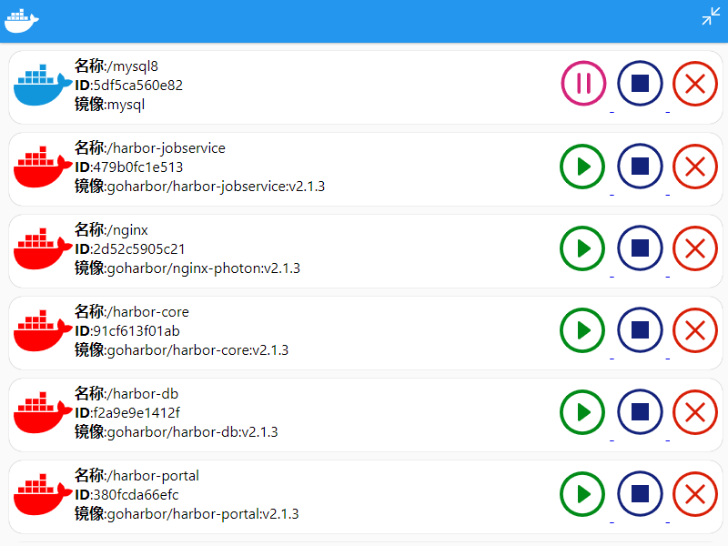
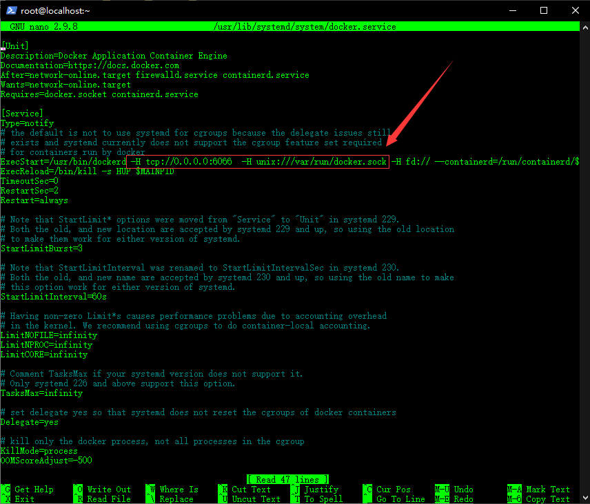
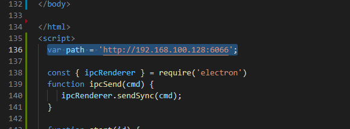

# 一个docker可视化客户端



# 安装依赖

npm install

## docker配置

在```/usr/lib/systemd/system/docker.service```中的```ExecStart```中添加```-H tcp://0.0.0.0:6066  -H unix:///var/run/docker.sock```参数以开启restfulapi



# 客户端配置

在源代码的```index.html```中```path``` 变量修改为docker的ip,端口为本文上节中配置的(6066)



# 打包客户端

安装依赖

```npm install electron-packager -g```

开始打包

```electron-packager . docker-admin --out make```

程序输出在源代码的make文件夹下


# 已打包的程序修改ip

在源代码下的```make\docker-admin-win32-x64\resources\app\index.html```文件修改path变量